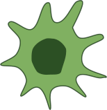

<aside>
💡 Associated VCAA Study Design Dot Points: 
  
<ul> <i> 
<li> initiation of an immune response, including antigen presentation, the distinction between self-antigens and non-self antigens, cellular and non-cellular pathogens and allergens </li>
<li> physical, chemical and microbiota barriers as preventative mechanisms of pathogenic infection in animals and plants </li>
<li>
the innate immune response including the steps in an inflammatory response and the characteristics and roles of macrophages, neutrophils, dendritic cells, eosinophils, natural killer cells, mast cells, complement proteins and interferons </li>
</i>
</ul>
</aside>

## Antigens

Antigens are:

<ul>
<li> <b> foreign markers </b> (non-self, typically large, complex molecules, usually proteins or glycoproteins on cell surface)
</li> 
<li> <b> which induce an immune response </b> in the body 
</li> 
<li> either alone or </li>
<li> after forming a complex with a larger molecule that causes the production of antibodies and is capable of binding with an antibody <\li>
</ul>

The immune system uses antigens to recognise foreign substances as ‘non-self’; to know what to attack.

Foreign substances typically come from <b>pathogens</b>.
Pathogens are organisms or infectious particles (cellular or non-cellular agents) that are able to cause disease (disruption to normal functioning) in a host cell.

 
 
 

<b> What does the immune system use to recognise 'self'? </b>

There are specific group of glycoproteins, which are cell surface proteins, that mark a cell as ‘self’ (self-antigens). These proteins are called Major Histocompatibility Complex (MHC). 

Our cells are able to determine ‘Self’ and ‘Non-self’ through the presence or absence of self molecules on the surface of the cellular membrane. 

Self-molecules are most important in the adaptive immune system (also known as the specific, or 3rd Line of defence). 

  

## What is the difference between an antigen and  an allergen?

An allergen is an antigen, but not all antigens are allergens. An antigen is any substance that's capable of causing your immune system to produce antibodies. They are typically organic produced proteins. An allergen is any antigen that causes an allergic reaction. An allergen is typically harmless for most individuals. 

 
  

# The innate immune response

Immune responses are often categorised into innate (non-specifc) and adaptive (specific).

The innate immune system responses to infection rapidly, without needing prior exposure or priming because it is not specific to a particular pathogen. 

## Important players in the innate immune response

<h3 style="color:#D32F2F">  Proteins: </h3>

<b>Complement proteins</b>

Proteins that circulate the plasma in their inactive form.
When they are broken down into smaller components, 
they are able to rapidly trigger a downstream series of reactions that amplify the immune response 
(a process called the 'complement cascade'). 
The complement cascade can be triggered by foreign material, pathogens, 
infected cells and antibody-antigen complexes. 

 
 The complement protein cascade has three main functions: 

<ul>
<li>
<b>Increase phagocytosis</b>: Attach to invading micro-organisms (a process called opsonization), making it easier for phagocytes to engulf these pathogens
</li>
<li>
<b>Lyse cell membranes</b> of fungi and bacteria 
</li>
<li>
<b>Promote inflammation</b> to recruit phagocytes to the area of infection, so they clear pathogens and infected cells
</li>
</ul>

These functions 'complement' the jobs of the adaptive immune response - 
which is why these proteins are called complement proteins. 
Complement proteins are able to be activated rapidly, 
and rapidly amplify the immune response in infected regions of the body. 

 

<b> Interferons </b>

Interferons are anti-viral proteins produced by virally infected cells. 
They are a kind of cytokine: A signalling molecule that regulates immune responses, typically in an autocrine (impacting the cell that secreted the cytokine) or paracrine (impacting nearby cells) manner. 

The three main immune functions of interferons are:

<ul>
<li>
Interfere with virus replication
</li>
<li>
Stimulate macrophages and natural killer cells
</li>

 

<h3 style="color:#D32F2F"> Cells: </h3>

<b>Antigen Presenting Cells:</b>

<ul>
<li>
The main role of antigen-presenting cells: <b>engulf foreign particles and 
present fragments of these antigens like ‘flags’ on their cell surface</b>
</li>
<li>
They <b>signal to T-cells and other adaptive immune system cells</b> 
that they are displaying non-self molecules, not
by <b>placing these antigen fragments on 
MHC (Major Histocompatibility Complex) Class II</b> protein molecules
</li>
<li> 
B lymphocytes, dendritic cells and macrophages are Antigen Presenting Cells.
</li>
</ul>

 
<b>Macrophages</b>

Mnemonic device to remember their phagocytotic role is: Code <b>RED</b>.

<ul>
<li>
<b>Antigen Presenting Cell</b>: Display the antigens of ingested pathogens to trigger an adaptive immune response
</li>
<li>
<b>R</b>ecognise, <b>engulf</b> and <b>destroy</b> foreign material
</li>
<li>
Engulf antibody-antigen complex
</li>
</ul>

 
<b>Dendritic cells</b>

<ul>
<li>
Important <b>Antigen Presenting Cell</b>
</li>
<li>
Many dentritic cells are tissue-resident dentritic cells:
typically sitting dormant tissues near the surface of the body, 
and grow branched projections ('dendrites') that search their environment for foreign material
</li>
<li>
Once they Code <b>RED</b>: <b>R</b>ecognise, <b>engulf</b> and <b>destroy</b> foreign material,
they travel to the lymph nodes, and present antigen fragments to T-cells and B-cells
</li>
</ul>

 
<b>Neutrophils</b>

<ul>
<li>
Most common white blood cell (leukocyte)
</li>
<li>
Are phagocytes so they follow Code <b>RED</b>: 
<b>R</b>ecognise, <b>engulf</b> and <b>destroy</b> foreign material
</li>
<li>
They are granulocytes: contains large vesicles of immune regulatory or 
anti-antigen substances 
</li>
<li>
During degranulation, they release anti-micrbioal substances
</li>
</ul>

 
<b>Eosinophils</b>

<ul>
<li>
They are granulocytes: contains large vesicles of immune regulatory or 
anti-antigen substances 
</li>
<li>
When triggered, they degranulate (release their granules) 
which releases cytokines,
enzymes, and reactive oxygen species.
</li>
<li>
Important in the immune response to parasites (multi-cellular organisms), 
and in allergic responses
</li>
</ul>

 
<b>Mast cells</b>

<ul>
<li>
Large resident cells in connective tissue
</li>
<li>
Also a granulocytes: contain many granules of histamines
</li>
<li>
Release histamine when triggered by antigen or 
allergen binding to antibodies (IgE) on their cell surface
(effects are under inflammatory response) 
</li>
</ul>

 
<b>Natural Killer Cells</b>

<ul>
<li>
Type of lymphocyte (white blood cell, found in the lymphatic system)
</li>
<li>
Attack and kill virally infected cells and cancer cells
</li>
<li>
They kill by sending cytokines instructing infected or cancer cells to apoptose
</li>
</ul>

 
 
 

## Barriers

The first line of immunological defence against pathogens are barriers. 
These barriers can be physical, chemical or microbioata.

 
 
 Can you list some examples of physical barriers to pathogens trying to infect an animal? 

 
 <ul>
 <li>
 skin surface
 </li>
 <li>
 Mucus in the respiratory tract
 </li>
 <li>
 Ear wax
 </li>
 <li>
 Urinary tract flushing
 </li>
 </ul>
 
 

 
 
 
 
  
 What are some examples of chemical barriers to pathogens in animals? 
 
  
  <ul>
  <li>
  Enzymes found in saliva and tears (e.g., Lysozyme which breaks down bacterial cell walls)
  </li>
  <li>
  Stomach acids 
  </li>
  <li>
  Sweat (contains salt which absorbs water from cellular pathogens) 
  </li>
  </ul>
  

 
  
 What are some examples of microbiotic barriers to pathogens in animals?   

  
  <ul>
  <li>
  Skin microbiome
  </li>
  <li>
  Gut microbiome
  </li>
  <li>
  Genetial and vaginal microbiome
  </li>
  </ul>
  

 
 

## Steps in the Inflammatory Response

As you will notice in the below, histamine plays a very big role in the inflammatory response. 

The inflammation response is important for preventing or stopping infection when barriers are broken. 

But allergic reactions also trigger the inflammatory response: this is why people experiencing hay fever often take anti-histamine medications! 

<ul>
<li>
Mast cells release histamines 
</li>
<li>
Histamine causes nearby arterioles to expand (inflammation!)
</li>
<li>
Expanded arterioles lead there to be more blood to the region, hence more white blood cells in the area
</li>
<li>
Histamine causes capillaries to become highly permeable
</li>
<li>
Macrophages can pass from the bloodstream to infected tissue more easily
</li>
<li>
Histamine attracts phagocytes (Neutrophils are often the first to travel to the inflamed region)
</li>
<li>
Dead phagocytes form pus 
</li> 
</ul>

 
 

# Extra resources

 

##  Douchy's VCE Biology Podcast 
 
<iframe style="border-radius:12px" src="https://open.spotify.com/embed/episode/2pqHstbbnTNf2MrB46FeBH?utm_source=generator" width="100%" height="352" frameBorder="0" allowfullscreen="" allow="autoplay; clipboard-write; encrypted-media; fullscreen; picture-in-picture" loading="lazy"></iframe>