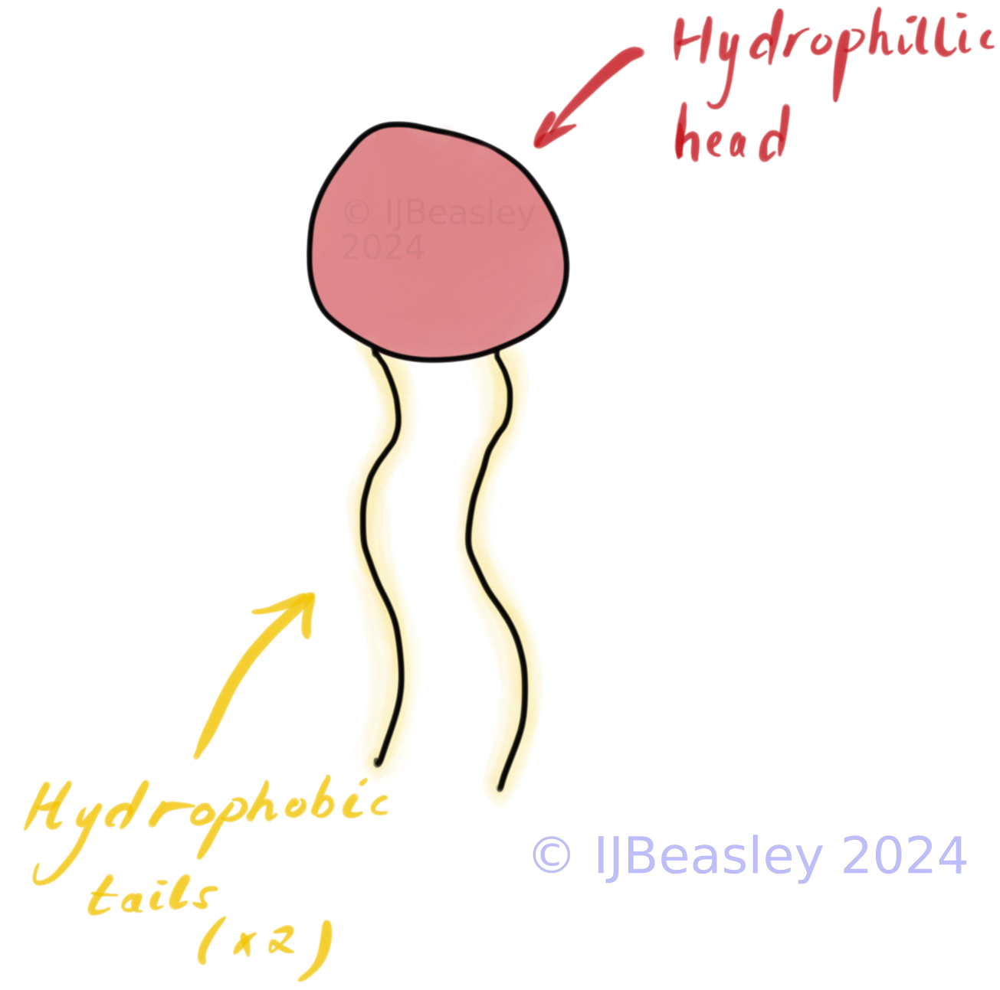
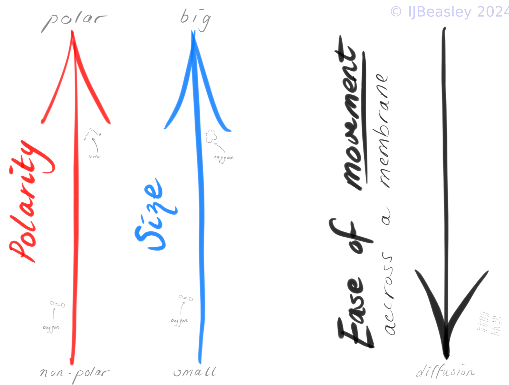

<h2 style="color:#D32F2F">
Relevant VCAA 2022 Study Design Dot Points:    
</h2> 

Unit 1 (Area of study 1): Cellular structure and function

- *the structure and function of the plasma membrane in the passage of water, hydrophilic and hydrophobic substances via osmosis, facilitated diffusion and active transport* 

  

<h2 style="color:#D32F2F"> Introduction to Membrane Transport </h2>
 
How do smaller molecules get into and out of the cell? 

 
...Well, through the plasma membrane, of course! 

But not every small molecule, across every time / context will travel through the plasma membrane in the same way. Some small molecules travel directly in between the phospholipid molecules, some travel across the membrane with a little help from a protein, others need an energy (ATP) boost to make their way into or out of the cell. 

 
 
 

<h2 style="color:#D32F2F"> Structure of the plasma membrane </h2>

<h3> Drawing Time (~20 mins) </h3>

For VCE Biology you will often need to draw a plasma membrane, and in particular the phospholipids which comprise most of the plasma membrane. On a piece of paper, or an electronic whiteboard, let's draw these important features together. 

<h3> Questions to check you know how to draw the important features questions: </h3>

<b> What are the important features of phospholipids to draw? </b>

 
         
 Unlabelled diagram hint 

         

 
         
 Final labelled diagram solution 

Phospholipids need their hydrophilic head and hydrophobic tails (x2)

 

 
<b> What might be some important features of the plasma membrane to draw? </b>

 
         
 Unlabeled diagram hint 

  
 
   

   

 
         
 Final labelled diagram answer 

                  
 

      
    
 

 
         
 

<h2 style="color:#D32F2F"> From Structure to function </h2>

 
        
 Why are these features important? 

<ul>
<li> The tails are attracted to each other so they form the distinctive *'bi-layer'* of the membrane (i.e. the two layers of phospholipids which make up the plasma membrane). </li>

<li>The tails then become part of the centre of the plasma membrane - which repel hydrophilic substances.  </li>
<li> This structure means the plasma membrane is <b> 'selectively permeable' - i.e. it regulates the movement of substances into and out of the cell. </b> </li>
 
</ul>

    
 How do these features impact what is able to easily cross membranes - and what isn't? 

<ul>
<li> Because the plasma membrane is selectively permeable, only some substances can cross the membrane with ease. Others have a more difficult time. </li>
<li> How easy or hard a substance finds crossing the membrane through jumping between the phospholipids is due to the <b> size of the gaps between phospholipids </b> and  <b> whether the substance is repelled by the tails </b>  </li> 
</ul>
 

 
 
 

<h2 style="color:#D32F2F"> Movement Across a Membrane (~20 mins) </h2>

                  
 
                  
There are three things which impact how easily a substance is able to cross a membrane. 

 
         
 <b> Size 💢 </b> 

- Smaller substances can fit between the gaps in phospholipids - and don't need a protein helper.
- Big substances need a larger gap, which can be created by a protein channel or gate.

         
 <b> Polarity 🎣 </b> 

- Non-polar (hydrophobic) molecules are not repelled by the phospholipid tails - and thus don't need a protein helper.
- Polar (hydrophilic) molecules are repelled, and need a protein helper (like a channel or gate) to shield them

 <b> Concentration Gradient 🏔️ </b> 

- Natures tendency is for substances to move from high to low concentrations.
- Energy is required if we are to go in the opposite direction of nature / concentration gradient
- Protein helpers are needed to get ATP converted to ADP + Pi at the right place and time (when going against the gradient)

 

It is the combination of these factors that determines whether a substance can just pass directly across a membrane, or whether it needs some extra protein help. Ridiculously big things or when we have lots and lots of small things moving at once use vesicles to get into and out the cell.  

When your teacher or VCAA asks you to predict the type of transport for substance, or explain why a particular substance travels in a particular method - you need to *include all three components in your answer.* 

 
 
 

<h2 style="color:#D32F2F">  The Movement Equation (Test) </h2>

Predict how likely a given substance is to directly cross the plasma membrane given the following equations. Explain why using the three major components impacting movement across a plasma membrane listed above. 

1. Example: Nitrogen Gas

$$ \text{Small size} + \text{Non-Polar} + \text{With the concentration gradient} = $$

2. Example: Carbon Dioxide

$$\text{Small Size} +  \text{Non-polar} + \text{Against the concentration gradient} = $$

3. Example: Water

$$\text{Small Size} + \text {Polar} + \text{With the concentration gradient} = $$

4. Example: Ethanol

$$ \text{Small~Size +}\text{Mostly non-polar} + \text{With the concentration gradient} = $$

5. Example: Protein 

$$ \text{Massive size + Polar} + \text{With the concentration gradient = } $$

 
 
 

         

<h2 style="color:#D32F2F">  This lesson's TL;DR </h2>

- The plasma membrane is responsible for the regulation of substances into and out of the cell (it is selectively permeable)
- Phospholipids have a specialised structure that mean smaller, and non-polar molecules have an easier time crossing the membrane

 

# Extra Resources 

##   Douchy's VCE Biology Podcast   

<iframe style="border-radius:12px" src="https://open.spotify.com/embed/episode/525829G1DbWywwT2ZIV3Lv?utm_source=generator" width="100%" height="352" frameBorder="0" allowfullscreen="" allow="autoplay; clipboard-write; encrypted-media; fullscreen; picture-in-picture" loading="lazy"></iframe>
